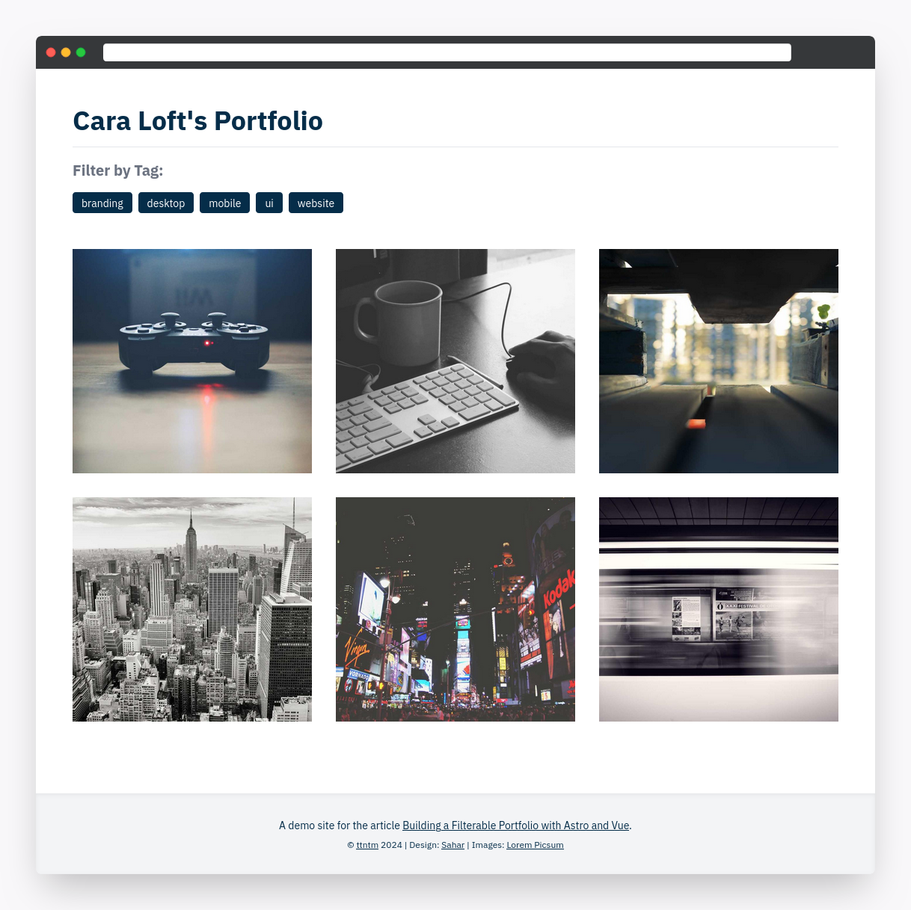

# Astro Portfolio Starter

A filterable portfolio built with Astro.

A detailed article about this starter can be found here: [Building a Filterable Portfolio with Astro and Vue](https://ttntm.me/blog/building-portfolio-with-astro-and-vue/)

## Demo

[](https://codesandbox.io/p/github/ttntm/astro-portfolio-starter/main)

> Live demo: [codesandbox.io/p/github/ttntm/astro-portfolio-starter](https://codesandbox.io/p/github/ttntm/astro-portfolio-starter/main)


## Using this Starter

### Prerequisites

1. Astro (developed and tested with version 4.0.2)
2. Vue (Astro integration)
3. Tailwind CSS (Astro integration) + typography plugin

### Setup

1. Fork, clone or download
2. `cd` into the root folder
3. run `npm install`
4. run `npm run dev`
5. open a browser and go to `http://localhost:4321`

### Configuration

1. Astro: `./astro.config.mjs`
2. Tailwind: `./tailwind.config.cjs`

CSS (in `./src/styles/`) is processed by Astro directly; this project is using the [Tailwind integration module](https://docs.astro.build/en/guides/integrations-guide/tailwind/).

**Deployment:**

Astro requires the final deployed URL in its config file.

Replace the placeholder with your site's URL and keep the trailing slash:

```js
case 'production':
  build.siteURL = 'https://example.com/'
  break
```

### Templates/Layouts

Page structure and templates are stored in `./src/layouts/` and can be edited there.

`./layouts/Base.astro` exposes 2 slots - one named `header` and a default one - which are used to inject the actual page content.

The portfolio is a [collection](https://docs.astro.build/en/guides/content-collections/) that's defined in `./src/content/config.ts`. Collection pages (in `./src/content/portfolio/`) are processed in alphabetical order by the `[...path].astro` page template in `./src/pages/`. Its `getStaticPaths()` function processes the whole collection and generates both the index/list page (via `path: undefined`) and the individual project pages (via `path: page.slug`) rendered by the project page template in `./src/layouts/PortfolioLayoutSingle.astro`.

### Content Management

Page content is stored in

- `./src/pages/` (Astro's default; see [docs](https://docs.astro.build/en/basics/astro-pages/))
- `./src/content/portfolio/`

#### Images

Images are stored in `./public/img/` and are _not_ being processed by any image optimization.

This is probably not ideal, but `getImage()` from `astro:image` ([docs](https://docs.astro.build/en/guides/images/)) can only be used on the server side, meaning that conditional rendering based on filtered data will make it break (yes, I tried).

If image size and performance should become an issue at some point: I can recommend using [unlazy](https://unlazy.byjohann.dev/) together with a (blurred) placeholder image and an intersection observer (i.e. [useIntersectionObserver()](https://vueuse.org/core/useintersectionobserver/) from VueUse).

#### Tags

Portfolio projects must have one or more tags as defined for the `portfolio` collection in `./src/content/config.ts`.

Tags are extracted and processed automatically by the `getStaticPaths()` function of the `[...path].astro` page template in `./src/pages` and the `PortfolioList.vue` component in `./src/components/interactive/` to build the tag-based filters/sub-navigation.
